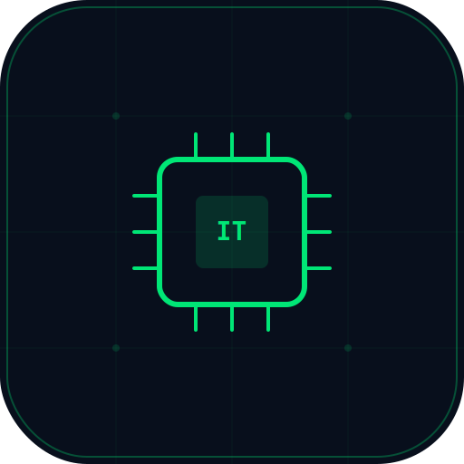

<div align="center">



# RSIMD-ITEMS

**IT Equipment Maintenance Management System**

*Office of the Head of Civil Service (OHCS) — Ghana*

Built by the Research, Statistics & Information Management Directorate (RSIMD)

---

[](https://rsimd-items.pages.dev)
[](https://rsimd-items-api.ghwmelite.workers.dev/api/health)
[](https://rsimd-items.pages.dev/guide)

</div>

---

## The Problem

OHCS manages quarterly IT equipment maintenance across 5 directorates, 5 units, and a secretariat using **manual Word documents, verbal reports, and memory-based tracking**. This creates:

- **2-week report compilation** at each quarter-end
- **No equipment registry** — technicians rely on room numbers and memory
- **No historical tracking** — recurring issues noticed anecdotally, not systematically
- **No real-time visibility** — management only sees status at quarter-end
- **Paper-dependent workflow** — data loss common, auditing impossible

## The Solution

RSIMD-ITEMS digitizes the entire maintenance workflow:

```
Register Equipment → Stick QR Labels → Scan & Log in the Field → Auto-Generate Reports
```

**Report generation: 2 weeks manual → 5 minutes automated.**

---

## Features

### Core System
| Feature | Description |
|---------|-------------|
| **Equipment Registry** | Register all IT assets with QR codes, OS version, processor generation, health scoring |
| **QR Scan-to-Log** | Scan device QR sticker → form pre-fills → log maintenance in seconds |
| **Maintenance Logging** | Mobile-first with voice input, photo capture, offline support |
| **Field Log Form** | Online checklist — tick issues, each creates a log automatically |
| **Auto Reports** | AI-generated quarterly DOCX matching OHCS format with tables and narratives |
| **Analytics Dashboard** | Real-time charts, QoQ comparison, entity drill-down, anomaly alerts |

### Intelligence
| Feature | Description |
|---------|-------------|
| **Health Scores** | 0-100 score per device based on age, failures, OS EOL, processor class |
| **Win11 Readiness** | Flags devices that can/cannot upgrade from Windows 10 |
| **Aging Fleet Report** | Age distribution, OS breakdown, flagged-for-replacement list with CSV export |
| **Smart Recommendations** | AI analyzes data patterns to generate challenges and procurement recommendations |
| **Anomaly Detection** | Auto-detects hotspot rooms, overloaded entities, recurring failures |

### Operations
| Feature | Description |
|---------|-------------|
| **PIN Authentication** | 4-6 digit PIN with @ohcs.gov.gh domain enforcement |
| **Role-Based Access** | Technician / Lead / Admin with granular permissions |
| **Audit Log** | Every admin action tracked — who, what, when |
| **Technician Workload** | Logs per technician per quarter with entity coverage |
| **Bulk Import** | CSV upload for mass equipment registration |
| **Bulk QR Print** | Select devices → generate A4 printable QR label sheet |

### Offline & PWA
| Feature | Description |
|---------|-------------|
| **Works Offline** | Maintenance logs saved to IndexedDB, auto-sync on reconnect |
| **Installable PWA** | Add to home screen on iOS/Android, works like native app |
| **Offline Photo Queue** | Photos stored as base64, uploaded during sync |
| **Cache Priming** | All reference data cached on login for instant offline access |
| **Retry with Backoff** | Failed syncs retry at 30s, 60s, 120s automatically |

---

## Tech Stack

| Layer | Technology |
|-------|-----------|
| **Frontend** | React 18 + TypeScript + Vite + Tailwind CSS |
| **API** | Cloudflare Workers (edge-native, zero cold start) |
| **Database** | Cloudflare D1 (SQLite at the edge) |
| **Cache** | Cloudflare KV (auth sessions, config) |
| **Storage** | Cloudflare R2 (reports, photos) |
| **AI** | Cloudflare Workers AI (Llama 3.1 70B for narratives) |
| **Charts** | Recharts |
| **Reports** | docx-js (programmatic DOCX generation) |
| **QR** | qrcode + html5-qrcode |
| **PWA** | Custom service worker with network-first navigation |

---

## Architecture

```
┌─────────────┐     ┌──────────────────┐     ┌─────────────┐
│  React PWA  │────▶│  CF Worker API   │────▶│  D1 (SQLite)│
│  (Pages)    │     │  (44 routes)     │     └─────────────┘
└─────────────┘     │                  │     ┌─────────────┐
                    │  Auth (KV)       │────▶│  KV Sessions│
                    │  AI Narratives   │     └─────────────┘
                    │  DOCX Assembly   │     ┌─────────────┐
                    │  Photo Upload    │────▶│  R2 Storage  │
                    └──────────────────┘     └─────────────┘
```

**Database: 9 tables**
`org_entities` · `equipment` · `maintenance_logs` · `maintenance_categories` · `technicians` · `reports` · `report_items` · `audit_log` · `sync_queue`

---

## Screenshots

<table>
<tr>
<td width="50%">

**Login** — Terminal boot sequence with PIN authentication
</td>
<td width="50%">

**Dashboard** — Real-time analytics with LED indicators
</td>
</tr>
<tr>
<td width="50%">

**Equipment** — Registry with health scores and QR codes
</td>
<td width="50%">

**Reports** — AI-generated DOCX with editable preview
</td>
</tr>
</table>

---

## OHCS Organizational Structure

| Type | Code | Name |
|------|------|------|
| Directorate | F&A | Finance & Administration |
| Directorate | RTDD | Research, Training & Development |
| Directorate | CMD | Conditions of Service, Manpower & Development |
| Directorate | PBMED | Performance, Benefits, Monitoring & Evaluation |
| Directorate | RSIMD | Research, Statistics & Information Management |
| Unit | COUNCIL | Council |
| Unit | ESTATE | Estate |
| Unit | ACCOUNTS | Accounts |
| Unit | AUDIT | Internal Audit |
| Unit | RCU | Reform Coordinating Unit |
| Secretariat | CD-SEC | Chief Director's Secretariat |

---

## Quick Start

### Prerequisites
- Node.js 18+
- Cloudflare account with Workers, D1, KV, R2, AI access
- Wrangler CLI

### Setup

```bash
# Clone
git clone https://github.com/ghwmelite-dotcom/RSIMD-ITEMS.git
cd RSIMD-ITEMS

# Install dependencies
npm install

# Initialize local database
cd api
npm run db:init
npm run db:seed

# Start API (localhost:8787)
npm run dev

# Start frontend (localhost:5173) — in another terminal
cd ../web
npm run dev
```

### Default Login
- **Email:** `admin@ohcs.gov.gh`
- **PIN:** `1234`

### Deploy to Production

```bash
# Create Cloudflare resources
wrangler d1 create rsimd_items_db
wrangler kv namespace create RSIMD_ITEMS_KV
wrangler r2 bucket create rsimd-items-files

# Update wrangler.toml with resource IDs

# Deploy API
cd api && wrangler deploy

# Build and deploy frontend
cd ../web
VITE_API_URL=https://your-worker.workers.dev npx vite build
wrangler pages deploy dist --project-name rsimd-items
```

---

## Project Stats

| Metric | Count |
|--------|-------|
| Commits | 84 |
| API source files | 24 |
| Frontend source files | 79 |
| API routes | 44 |
| Database tables | 9 |
| UI components | 30+ |
| Pages | 13 |

---

## Documentation

| Resource | URL |
|----------|-----|
| **Live System** | [rsimd-items.pages.dev](https://rsimd-items.pages.dev) |
| **User Guide** | [rsimd-items.pages.dev/guide](https://rsimd-items.pages.dev/guide) |
| **Field Form (printable)** | [rsimd-items.pages.dev/field-form](https://rsimd-items.pages.dev/field-form) |
| **API Health** | [rsimd-items-api.ghwmelite.workers.dev/api/health](https://rsimd-items-api.ghwmelite.workers.dev/api/health) |

---

## License

Internal system built for the Office of the Head of Civil Service, Ghana.

Built by **RSIMD IT Unit** · Powered by **Cloudflare Workers** · AI by **Meta Llama 3.1**

---

<div align="center">

*Transforming IT maintenance from memory-based to data-driven.*

**OHCS Ghana** · Research, Statistics & Information Management Directorate

</div>
